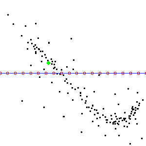
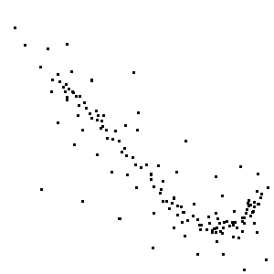
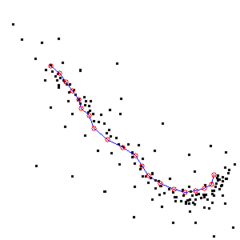

# self_orgainizing_maps

Simple C++ implementation of Self Organizing Maps.

See <https://en.wikipedia.org/wiki/Self-organizing_map>.

A demo loads samples in 2d space from scatter plot images. Non-white pixels
represent data points.



## Building
Use cmake to build.

```
mkdir build
cd build
cmake ..
```

## Running
After building, run from within `build` folder from above

Run tests with:

```
./run-tests
```


Run linear demo example with provided scatter plot:

```
./demo-linear ../img/linearScatter.png
```

This will fit a linear Self Organizing Map of 20 nodes to a dataset populated from points on a scatter plot contained in `img/linearScatter.png`.



You may specify any other scatter plot image as the first argument.
A scatter plot must have a white `HEX: #FFFFFF` field and any non-white pixel 
provides the coordinates of an input data point. 

Results will appear in a new file called `result.png`


